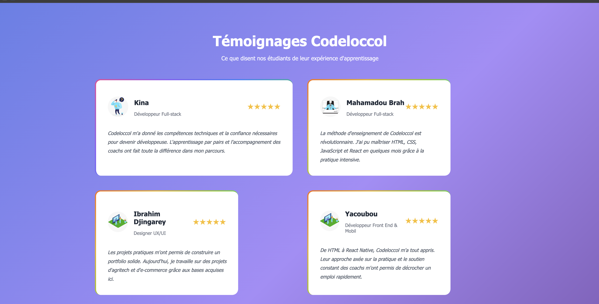

# Testimonial Grid Codeloccol

Ce projet présente une grille de témoignages d’étudiants et de professionnels ayant suivi la formation Codeloccol. Il met en avant leurs retours d’expérience, leurs métiers et leur satisfaction à travers une interface moderne et responsive.

## Fonctionnalités

- Affichage de plusieurs témoignages avec photo, nom, métier et avis.
- Design responsive adapté à tous les écrans.
- Utilisation de HTML et CSS pour la mise en page et le style.

## Structure du projet

```
/Testimonial
│
├── index.html      # Page principale avec la grille de témoignages
├── style.css       # Fichier de styles pour la mise en forme
├── social_1.jpeg   # Images des avatars
├── social_2.jpeg
├── social_3.jpeg
├── social_4.jpg
├── social_5.png
```

## Démarrage rapide

1. Clone le dépôt ou télécharge les fichiers.
2. Ouvre `index.html` dans ton navigateur.
3. Personnalise les témoignages ou le style dans `style.css` selon tes besoins.

Mon experience pendant le cursuse de ce projet sa ma aider a afuité de plus mes connaissance en html/css 

## Auteur

Projet réalisé par [A_karim] étudiants a Codeloccol.

---


N’hésite pas à adapter ce README selon tes besoins spécifiques !