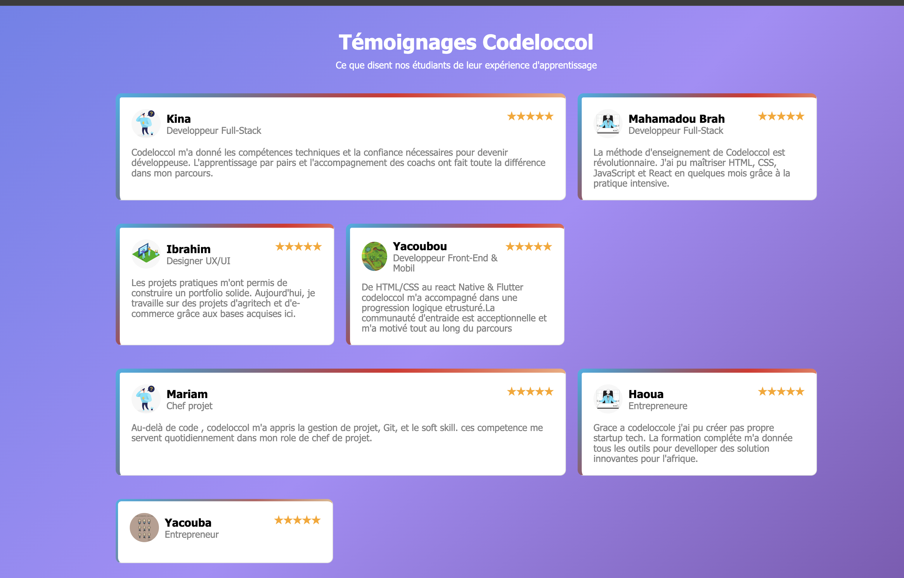

# Témoignages Codeloccol (Version Améliorer)

Ce projet présente une grille de témoignages d’étudiants et de professionnels ayant suivi la formation Codeloccol. Chaque carte affiche le nom, le métier, la photo et l’avis de l’étudiant.

## Description

J’ai rencontré plusieurs difficultés lors de la réalisation de ce projet. Après avoir été confronté à un rejet de mon travail, j’ai dû tout supprimer et recommencer depuis zéro. Cette expérience m’a permis d’apprendre à persévérer, à mieux organiser mon code et à améliorer la qualité de la présentation.

## Fonctionnalités

- Affichage de témoignages sous forme de cartes.
- Design responsive (adapté à tous les écrans).
- Utilisation de HTML et CSS.
- Images et notes pour chaque témoignage.

## Structure du projet

```
/Testimonial
│
├── index.html      # Page principale
├── style.css       # Fichier de styles
├── social_1.jpeg   # Images des avatars
├── social_2.jpeg
├── social_3.jpeg
├── social_4.jpg
├── social_5.png
```

## Installation

1. Télécharge ou clone le projet.
2. Ouvre `index.html` dans ton navigateur.

## Difficultés rencontrées

- Rejet du projet initial.
- Suppression complète et reprise à zéro.
- Organisation du code et gestion des fichiers images.
- Correction des fautes et amélioration de la structure HTML.
- Est sans oublier l'aide d'un staff vraiment aimable Abassa 

## Auteur

Projet réalisé par un étudiant [A_Karim] de Codeloccol, avec persévérance et envie d’apprendre.
 # Voilà un aperçus de ma page #
    

---

Merci de prendre en compte mon parcours et les efforts fournis pour aboutir à ce résultat.